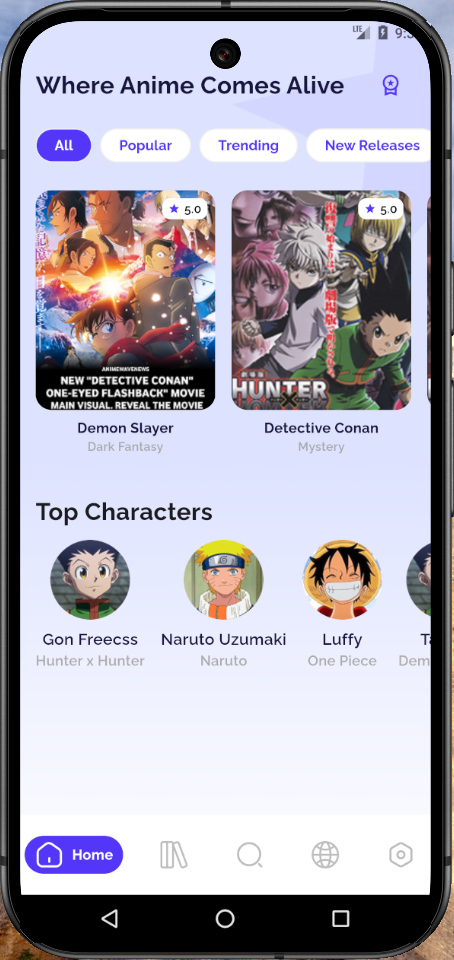
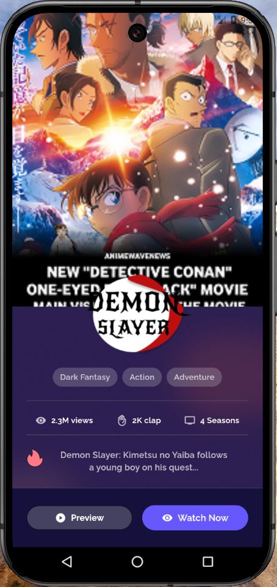
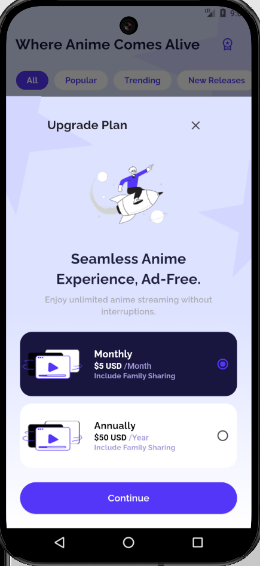

 # Anime App

 A Flutter project showcasing a beautiful Anime browsing experience.


## Screenshots

Below are some screenshots of the app:

<p align="center">
   
   
   
</p>

## Overview

This project provides a clean and user-friendly interface for discovering and exploring Anime. It leverages Flutter's capabilities to deliver a smooth and responsive experience on both Android and iOS platforms.

 ## Key Features

 *   Browse a curated list of popular Anime.
 *   View detailed information about each Anime, including descriptions, ratings, genres, and statistics.
 *   Enjoy a visually appealing and intuitive user interface.

 ## Getting Started

 To run this project locally, follow these steps:

 1.  Ensure you have Flutter installed. If not, follow the [official Flutter installation guide](https://docs.flutter.dev/get-started/install).
 2.  Clone this repository.
    ```bash
    git clone <repository_url>
    ```
 3.  Navigate to the project directory.
    ```bash
    cd anime
    ```
 4.  Install the dependencies.
    ```bash
    flutter pub get
    ```
 5.  Run the app.
    ```bash
    flutter run
    ```

 ## Contributing

 Contributions are welcome! If you'd like to contribute to this project, please follow these guidelines:

 1.  Fork the repository.
 2.  Create a new branch for your feature or bug fix.
 3.  Implement your changes.
 4.  Submit a pull request.

 ## Resources

 *   [Flutter Documentation](https://docs.flutter.dev/)
 *   [Flutter Cookbook](https://docs.flutter.dev/cookbook)
